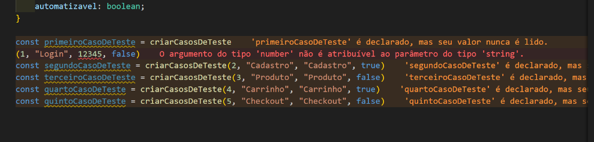

# Automação QA - Casos de Teste em TypeScript

Este projeto faz parte do curso de **Automação de Testes de Software (QA)** e tem como objetivo praticar conceitos fundamentais de **TypeScript**, como criação de tipos personalizados (`type`), tipagem estática de parâmetros e retorno de funções, manipulação de objetos e identificação de erros de compilação/tipagem estática.

---

## 📋 O que foi feito no arquivo `casos-de-teste.ts`

No arquivo `src/atividades/casos-de-teste.ts`, foram implementadas as seguintes estruturas:

1. **Definição de Tipo (`type CasosDeTestes`)**:
   Estrutura de dados para representar um caso de teste:
   ```typescript
   type CasosDeTestes = {
       id: number;
       titulo: string;
       descricao: string;
       automatizavel: boolean;
   }
   ```

2. **Função de Criação (`criarCasosDeTeste`)**:
   Recebe os parâmetros tipados e retorna um objeto do tipo `CasosDeTestes`:
   ```typescript
   function criarCasosDeTeste(id: number, titulo: string, descricao: string, automatizavel: boolean): CasosDeTestes {
       return { id, titulo, descricao, automatizavel };
   }
   ```

3. **Função Utilitária de Descrição (`descrever`)**:
   Retorna uma string formatada contendo o identificador e o título do caso de teste.

4. **Função de Atualização de Status (`marcarAutomatizavel`)**:
   Verifica se o caso de teste já é automatizável; se não for, altera a propriedade `automatizavel` para `true`.

5. **Instanciação de Casos de Teste**:
   Criação de 5 casos de teste (`primeiroCasoDeTeste` até `quintoCasoDeTeste`) para simular cenários como *Login*, *Cadastro*, *Produto*, *Carrinho* e *Checkout*.

---

## 🔍 Análise do Erro da Imagem



Durante a instanciação do `primeiroCasoDeTeste`, o editor apontou erros e alertas:

```typescript
const primeiroCasoDeTeste = criarCasosDeTeste
(1, "Login", 12345, false)
```

### 1. Erro de Tipagem (Type Error / TS2345) 🔴

- **Mensagem do Erro**:
  > `"O argumento do tipo 'number' não é atribuível ao parâmetro do tipo 'string'."`
- **Tipo de Erro**:
  **Erro de Tipo em Tempo de Compilação (Static Type Checking Error)** provocado pelo verificador de tipos do TypeScript.
- **Causa**:
  O 3º parâmetro da função `criarCasosDeTeste` é `descricao`, que foi estritamente definido com o tipo `string`. Ao invocar a função, foi passado o valor numérico `12345` (`number`), gerando incompatibilidade de tipos:
  - **Esperado**: `string`
  - **Recebido**: `number` (`12345`)

#### ✅ Como Corrigir:
Passe um valor do tipo `string` para o campo de descrição:
```typescript
// Opção 1: Passar a descrição textual
const primeiroCasoDeTeste = criarCasosDeTeste(1, "Login", "Fluxo de login de usuário", false);

// Opção 2: Passar o número entre aspas como string
const primeiroCasoDeTeste = criarCasosDeTeste(1, "Login", "12345", false);
```

---


## 🚀 Como Executar o Projeto

### Pré-requisitos
- [Node.js](https://nodejs.org/) instalado na máquina.

### 1. Instalar as dependências
No terminal, execute na raiz do projeto:
```bash
npm install
```

### 2. Verificar erros de tipos (Type-check)
Para checar a tipagem do TypeScript sem gerar arquivos de saída:
```bash
npm run type-check
```
> O TypeScript irá acusar o erro de tipo em `src/atividades/casos-de-teste.ts` na linha onde o número `12345` é passado.

### 3. Executar o arquivo de casos de teste
Após corrigir o erro de tipo, execute o script criado com o comando:
```bash
npm run case
```
*(Este comando roda `npx tsx src/atividades/casos-de-teste.ts`) script criado pelo usuário a fim de agilizar a execução do arquivo*